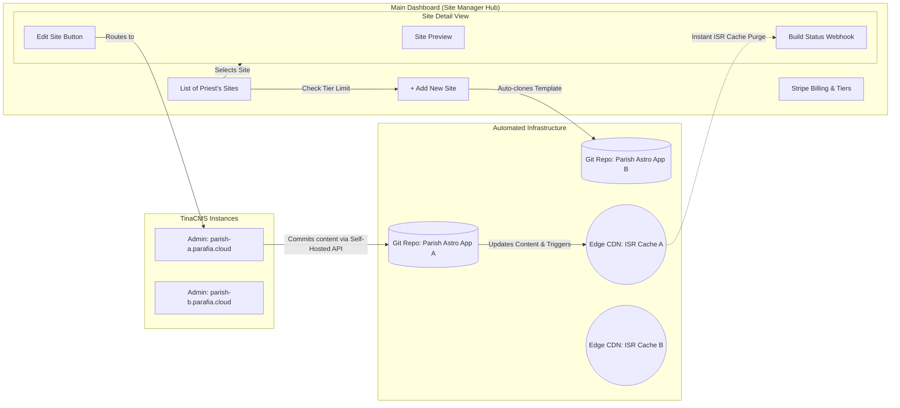

# MVP Definition: Parish Cloud

> **Parish Cloud** is a specialized Software-as-a-Service (SaaS) platform enabling Catholic parishes to deploy professional, maintenance-free websites. Technically, it is a Headless CMS solution built using a **Turborepo** monorepo, **Astro** for lightning-fast frontend delivery, and a **Self-Hosted TinaCMS Backend**. We utilize a **"Thin Dashboard, Fat CMS"** approach: the main SaaS dashboard acts as a Hub handling provisioning, billing, and live site previews, while all site management (templates, publishing, volunteers) happens directly inside isolated TinaCMS instances.
>
> In the MVP phase, Priests can manage **multiple parish websites under a single account**. They create sites via a **self-service onboarding flow** (sign up → create website → get subdomain → view dynamic preview → edit in TinaCMS). **Monetization:** Accounts start on a trial; to keep sites live or add multiple sites, Priests subscribe to a tier.

---

## 1. Problem Statement

Catholic parishes struggle to maintain a professional and modern web presence. The core pain points include:

- **Technically unfriendly platforms:** Most parish websites are built on WordPress, which demands ongoing technical maintenance that parish staff are not equipped to handle.
- **High cost, low value:** Existing solutions are expensive relative to the limited functionality parishes actually need.
- **Outdated, cookie-cutter designs:** Agencies tend to offer generic templates with an outdated look and feel.
- **Managing Multiple Sites:** Priests who oversee multiple parishes (a common scenario) currently have to juggle multiple disparate logins, hosting providers, and bills.

**In short:** Parishes are stuck choosing between expensive, overly complex platforms they can't manage and cheap, templated sites that look outdated.

## 2. Target Audience & Early Adopters

**Primary Users:**

- **Parish Priests** — Account owners. They handle the SaaS dashboard (billing, creating new sites) and oversee the CMS.
- **Parish Volunteers / Secretaries** — handle the day-to-day content updates (announcements, events) inside TinaCMS under the priest's oversight.

**Key characteristic:** Both user types are typically non-technical and need an interface that requires zero training.

**Early Adopters (Go-to-Market Strategy):**

- **Local parishes in the founder's area** — adoption will be driven manually via the "Concierge" onboarding approach, allowing for high-touch support and direct feedback.

## 3. Value Proposition

**Parish Cloud offers parish websites that are modern, effortless to manage, and significantly cheaper than existing alternatives.**

| vs. WordPress                                                                                                                                            | vs. Agency template sites                                                                                               |
| -------------------------------------------------------------------------------------------------------------------------------------------------------- | ----------------------------------------------------------------------------------------------------------------------- |
| **Cheaper & Faster** — Git-backed architecture (TinaCMS + Astro ISR) eliminates database bloat, ensuring instant page loads with zero-cost edge caching. | **Modern & unique** — Clean, contemporary designs that reflect the parish's identity, with easily switchable templates. |
| **Better UX** — A purpose-built editing experience designed for non-technical users, powered entirely by TinaCMS.                                        | **Self-service content** — Parishes own their content updates instead of waiting on an agency.                          |
| **Multi-Site Hub** — Priests can manage 2, 3, or more parish websites from a single login and billing portal.                                            | **Professional quality** — Without the ongoing agency retainer fees.                                                    |

## 4. Core Features (The "Minimum" in MVP)

### User Journeys

| Path                    | Journey                                                                                                                                                                                                                                |
| ----------------------- | -------------------------------------------------------------------------------------------------------------------------------------------------------------------------------------------------------------------------------------- |
| **Priest self-service** | `Sign up (trial) → Dashboard Hub → Add Site 1 → Auto-Provisioning → View Dynamic Preview & Build Status → Open TinaCMS → Switch Template & Publish` → before trial ends: `Subscribe to Tier`. (Later: `Add Site 2` via upgraded tier). |

### Trial & Multi-Site Subscription Model

| Concept                      | MVP scope                                                                                                                                                   |
| ---------------------------- | ----------------------------------------------------------------------------------------------------------------------------------------------------------- |
| **Trial account**            | New accounts start on a **trial**: allows creation of 1 site for a fixed period (e.g. 14 or 30 days). No payment required to start.                         |
| **Trial end**                | When trial expires: sites become inaccessible publicly until the account subscribes; no data deleted.                                                       |
| **Basic Subscription (MVP)** | For MVP, there is a single paid **Basic** tier: allows hosting **1 Website** per account on a free `[parish].parafia.cloud` subdomain.                      |
| **Advanced Tier (Future)**   | Custom Domain support (e.g., `www.stjohn.com`) and Multi-Site capabilities (e.g., hosting up to 3 or more sites) are planned as a post-MVP premium upgrade. |
| **Billing Hub**              | Recurring billing via Stripe. The Priest manages one unified bill for all their parish sites via the Main Dashboard.                                        |
| **Offline Payments**         | Handled via single-use, 100% discount Stripe Promotion Codes pinned strictly to the Priest's account. Used for parishes paying manually via check/invoice.  |

### Must-Have Features (P0)

#### 1. Main Dashboard (The Multi-Site Hub)

The Main Dashboard is the "thin" wrapper. It handles infrastructure, payments, and routing the user to isolated TinaCMS instances for each site.

1. **Site Manager Hub** — Upon login, the Priest sees a list/grid of all their active parish websites.
2. **Multi-Site Provisioning** — A button to "Add New Website". If their subscription allows it, the system automatically provisions a new Git repo and assigns a new `[parish].parafia.cloud` subdomain. If not, they are prompted to upgrade.
3. **Published Site Preview** — Clicking a specific site card opens that site's details, which redirects to or displays a preview of the _published_ website. Live draft previews are exclusively handled within the TinaCMS editor state.
4. **Live Build Status** — Synced via Cloudflare webhooks, the dashboard displays a loading state when a site is currently building/deploying, and updates the status once complete.
5. **Billing Portal** — View trial countdowns, select subscription tiers based on site count, enter Stripe payment details, and view invoices.
6. **Link to CMS** — A prominent "Edit Website" button on the site details page that redirects the Priest directly to that specific site's `/admin` TinaCMS route.

#### 2. The TinaCMS Editor Experience ("Fat CMS")

Each provisioned website has its own isolated TinaCMS editor. All actual site management happens here.

7. **Multiple Templates (Global Settings)** — The Priest opens the TinaCMS "Site Settings" and selects their preferred template from a dropdown (e.g., Modern, Traditional). Astro dynamically routes and renders the new UI wrapper while preserving the exact same underlying content.
8. **Visual Editing & Instant Updates** — While editing in TinaCMS, Astro runs in Preview Mode to show real-time changes instantly.
9. **Page-Level Publishing & ISR** — When changes are saved, they are committed to Git. Instead of waiting for a slow full-site rebuild, we use **Incremental Static Regeneration (ISR)** via Edge caching to instantly update that specific page in the background while keeping the rest of the site fully static and fast.
10. **Volunteer Access Management** — The Priest manages collaborators directly via the Self-Hosted Tina backend. They invite volunteers via email to access the `/admin` panel. Volunteers are restricted to editing content and cannot change templates or billing.

#### 3. Super Admin Side (You)

11. **Admin Dashboard (Analytics)** — View total accounts, total websites, active/past-due subscriptions, and MRR.
12. **Automated Offline Activations** — A built-in tool to automatically generate Stripe Promotion Codes (100% off, 1-time use, pinned directly to the target Priest's email/account). This securely grants subscription access for offline payments without bypassing Stripe's subscription engine.
13. **Service Account Access** — A master service account that automatically receives collaborator access to every provisioned TinaCMS instance. This allows Super Admins to provide direct technical support, debug content issues, and manage templates for any parish.

#### 4. Automated Technical Pipeline

14. **Isolated Git Repositories** — A new Git repo (forked from a master Astro Template app inside our Turborepo) is automatically generated via API for _every single site_ created, ensuring data isolation and easy global template updates.
15. **Self-Hosted Tina Backend** — Each site runs our own Astro API backend for TinaCMS, avoiding expensive 3rd-party CMS subscription limits and keeping Auth fully under our control.
16. **Hybrid Rendering (ISR) Pipeline** — The deployed Astro app uses Hybrid rendering. Core layouts are statically generated (SSG) for zero-cost caching, while dynamic content fetches use ISR (Stale-While-Revalidate) so Priests see their updates instantly without waiting for CI/CD build webhooks.

### Visual App Flow (Mermaid)

#### Multi-Site Architecture & Flow

