# MVP Definition: Romantic App

## 1. Problem Statement

**What is the core problem that this project aims to solve?** Please describe the pain points of the target users.

Helping people who have a lot of issues in relationships to meet each other perfectly. Many individuals struggle to find compatible partners and face challenges in understanding whether they are truly compatible with potential romantic interests.

## 2. Target Audience & Early Adopters

**Who are the primary users or customers for this product?** Can you describe our ideal early adopters who would be most receptive to an initial version?

**Primary Users:** Pairs - women and men seeking meaningful romantic connections.

**Early Adopters:** Couples or potential couples who are open to trying new, interactive ways to get to know each other better and are comfortable with gamified experiences in their relationship journey.

## 3. Value Proposition

**What is the unique value that our product offers to solve the identified problem?** How is it different from existing solutions?

The app creates a user profile where individuals set all required information, and then the app presents questions via game sessions about each other in a fun and engaging way. This gamified approach to relationship discovery makes the process of getting to know someone more enjoyable and less intimidating compared to traditional dating apps or questionnaires. The real-time game format with deadlines adds excitement and encourages authentic responses.

The quiz covers eight comprehensive relationship categories (Relationship Dynamics, Self-Discovery, Sexual Intimacy, Mutual Respect, Communication and Conflicts, Values and Life Goals, Love Languages and Showing Affection, Trust and Fidelity) plus creative question types (Drawing, Music, Trash Talk) that help couples explore compatibility across all aspects of their relationship. Questions are presented with varying difficulty levels, allowing couples to progress from light topics to deeper, more intimate conversations at their own pace. The simultaneous answering feature ensures honest responses without influence, and the results comparison helps couples understand their compatibility and areas for growth. The gamified scoring system (+1 for matches, 0 for no answer, -1 for mismatches) adds competitive fun, with the first player reaching 10 points declared the winner.

## 4. Core Features (The "Minimum" in MVP)

**Based on the value proposition, what are the absolute essential features needed for the initial version of the product to be viable?** Let's list them and prioritize them. We should focus on the 'must-haves' for the first release.

### Essential Features:

* **User Profile Creation** - Users can set up their profile with all required information

* **Basic Authentication** - Support for Google OAuth and traditional login/password authentication

* **Gaming Room System** - Ability to create gaming rooms and play with 2+ players (pairs)

* **Question Category System** - Eight comprehensive question categories covering:
  - Relationship Dynamics (daily interactions, communication patterns)
  - Self-Discovery (needs, values, emotions, behavioral patterns)
  - Sexual Intimacy (needs, boundaries, preferences)
  - Mutual Respect (how partners show respect, important behaviors)
  - Communication and Conflicts (communication styles, conflict handling)
  - Values and Life Goals (shared values, future vision)
  - Love Languages and Showing Affection (how partners express and receive love)
  - Trust and Fidelity (trust, fidelity, boundaries)
  - **Creative Expression** - Drawing-based questions for visual communication and understanding
  - **Music & Entertainment** - Music preference questions with YouTube integration
  - **Fun & Games** - Trash talk and word guessing questions for playful interaction

* **Question Format System** - Support for multiple question types:
  - Multiple choice questions
  - Scale questions (1-5 rating)
  - Yes/No questions
  - Open text questions (with character limits)
  - **Drawing Questions** - Users can draw shapes using a paint-like interface (e.g., "What is his favorite sport?" - both draw a ball). The app uses LLM image recognition to analyze drawings, identify what was drawn, and automatically match if both players drew the same thing. Users can also provide yes/no confirmation if needed.
  - **Music Questions** - Users write the name of their favorite song. If both answers match, the app automatically plays the song on YouTube for both players to enjoy together. The song plays immediately after the question is answered, regardless of whether the game has finished or not.
  - **Trash Talk Questions** - Word guessing game where the app displays 4 word suggestions. One player picks one of the 4 words (this becomes the secret word to guess). The other player must guess the selected word by saying other words that start with a specific letter (e.g., "M") to describe it, without directly saying the word itself. Each player has 3 attempts to guess correctly. Users provide their guesses via voice input, and the app uses LLM + voice recognition to verify: (1) the word really starts with the required letter, (2) the attempts (3) are not exceeded, and (3) the user is not directly telling the word. If a user fails to guess correctly within 3 attempts or is detected cheating (exceeding attempts, wrong letter, or directly saying the word), they lose 1 point.

* **Difficulty Levels** - Questions organized by difficulty (Easy, Medium, Hard) to allow progressive exploration

* **Game Session Mechanics**:
  - Category selection by players
  - Question randomization from selected category
  - Time limits for answers (30 seconds to 2 minutes depending on difficulty)
  - Simultaneous answering (both players answer without seeing partner's response)
  - Results reveal and comparison after both players answer
  - Educational tips and explanations after questions (optional)
  - **Drawing Question Flow** - Players draw simultaneously, drawings are captured and sent to LLM for image recognition. LLM identifies what was drawn and compares both drawings. If matches are found, points are awarded automatically. Manual confirmation option available if needed.
  - **Music Question Flow** - Players enter song names simultaneously. If both answers match, YouTube integration automatically plays the matching song for both players immediately after the question, regardless of game completion status.
  - **Trash Talk Question Flow** - App displays 4 word suggestions. One player picks one word from the 4 options (this becomes the secret word). The guessing player then attempts to guess by saying words starting with the specified letter via voice input to describe the word, without directly saying it. Each player has 3 attempts. Voice recognition captures the spoken word, and LLM verifies: (1) the word really starts with the required letter, (2) attempts (3) are not exceeded, and (3) the user is not directly telling the word. Points are deducted (-1) if a player fails to guess correctly within 3 attempts or is detected cheating (wrong letter, exceeded attempts, or directly saying the word).
  - **Win Detection** - System continuously monitors player scores and declares a winner when any player reaches the win threshold (default: 10 points)

* **Scoring and Compatibility System**:
  - **Point System per Question**:
    - **+1 point** - Both players provide the same answer (matching answers)
    - **0 points** - One or both players provide no answer (skipped or timed out)
    - **-1 point** - Players provide different/bad answers (mismatched answers)
  - Difficulty-based scoring (more points for harder questions when matched)
  - Honesty bonus for answering difficult questions
  - Category completion bonuses
  - Category summary with compatibility statistics
  - **Win Condition** - First player to reach 10 points wins the game session (win threshold can be adjusted to higher values for longer games)

* **User Experience Features**:
  - Ability to skip questions that are too difficult
  - Save questions for later
  - Answer history viewing
  - Ability to pause sessions at any time
  - Warnings before difficult or sensitive questions
  - Drawing canvas interface with tools (brush, colors, eraser) for drawing questions
  - YouTube player integration for music questions
  - Real-time score display showing both players' current points
  - Win celebration screen when a player reaches the win threshold

* **Technical Integrations Required**:
  - **LLM Image Recognition API** - For analyzing and matching drawings in drawing questions
  - **LLM Text Analysis API** - For verifying trash talk guesses: (1) ensuring words start with the required letter, (2) tracking and verifying attempts don't exceed 3, and (3) detecting if users are directly saying the secret word instead of describing it
  - **Voice Recognition API** - For capturing and transcribing spoken words in trash talk questions (e.g., Web Speech API, Google Cloud Speech-to-Text)
  - **YouTube Data API v3** - For searching and playing songs when music answers match
  - **Real-time WebSocket/Server-Sent Events** - For simultaneous answer submission and score updates
  - **Canvas/Drawing Library** - For drawing question interface (e.g., Fabric.js, Konva.js, or HTML5 Canvas)

## 5. "Measure" - Key Metrics for Success

**How will we measure the success of this MVP?** What key metrics will indicate that we are achieving our learning goals and that the product is resonating with users? (e.g., user sign-ups, feature adoption rate, user feedback scores).

* **300 games played in the first week** - Primary engagement metric indicating user adoption and active usage
* **Average app rating of 3.9-4.5** - User satisfaction metric indicating that the product is resonating positively with early adopters

## 6. "Learn" - Feedback and Iteration Plan

**What is our plan for gathering feedback from our early adopters?** (e.g., surveys, interviews, feedback forms within the app). How will we use this feedback to inform the next iteration of the product?

* **Distribution Strategy** - Sending links to the app to early adopters for testing
* **Built-in Feedback Module** - Integrated feedback collection system within the app to capture user insights, pain points, and suggestions
* **Iteration Process** - Feedback will be analyzed to identify common themes, prioritize improvements, and inform feature development for subsequent releases

## 7. Assumptions & Risks

**What are the biggest assumptions we are making with this MVP?** What are the potential risks that could prevent this MVP from being successful? (e.g., technical challenges, market acceptance).

### Key Assumptions:

* **User Engagement Assumption** - Couples will be willing to engage simultaneously in game sessions and commit time to answer questions together
* **Question Coverage Assumption** - The eight question categories plus creative question types (drawing, music, trash talk) comprehensively cover the aspects that matter most to couples in understanding compatibility
* **LLM Integration Assumption** - LLM image recognition will accurately identify and match drawings from both players, and LLM text analysis will effectively detect cheating in trash talk questions
* **Voice Recognition Assumption** - Voice recognition will accurately capture and transcribe spoken words in trash talk questions
* **YouTube Integration Assumption** - Users will appreciate automatic YouTube song playback when music answers match, regardless of game completion status
* **Gamification Assumption** - The competitive scoring system (+1/0/-1) and win condition (10 points) will enhance engagement without creating relationship tension
* **Progressive Difficulty Assumption** - Users will appreciate and engage with the difficulty level system, progressing from easy to hard questions
* **Honesty Assumption** - The simultaneous answering format will encourage honest responses without partner influence
* **Educational Value Assumption** - Users will find value in educational tips and compatibility insights provided after questions
* **Sensitive Topics Assumption** - Users will be comfortable discussing sensitive topics (sexual intimacy, trust, conflicts) within the app format

### Potential Risks:

* **Market Acceptance Risk** - Couples may not find gamified relationship discovery appealing or may prefer traditional conversation methods
* **User Adoption Risk** - Difficulty getting both partners to use the app simultaneously and commit to completing sessions together
* **Question Sensitivity Risk** - Some questions may be too personal or uncomfortable, leading to user drop-off or negative feedback
* **Time Commitment Risk** - Users may find the time required to complete categories too demanding, especially with time limits on answers
* **Privacy Concerns Risk** - Users may have concerns about sharing intimate relationship information, even within a private gaming room
* **Engagement Retention Risk** - Users may complete initial sessions but lose interest in repeated play or exploring all categories
* **Compatibility Interpretation Risk** - Users may misinterpret compatibility scores or results, leading to relationship stress rather than improvement
* **LLM Accuracy Risk** - LLM image recognition may incorrectly identify drawings, leading to false matches or mismatches. LLM text analysis may incorrectly flag legitimate guesses as cheating in trash talk questions
* **Voice Recognition Accuracy Risk** - Voice recognition may fail to accurately transcribe words, especially with accents, background noise, or unclear pronunciation, leading to incorrect validation
* **Competitive Tension Risk** - The scoring system and win condition may create unhealthy competition between partners rather than fostering connection
* **Technical Integration Risk** - YouTube API integration, LLM image processing, voice recognition, and LLM text analysis may introduce technical complexity and potential failures
* **Trash Talk Difficulty Risk** - The trash talk word guessing game may be too difficult or frustrating with only 3 attempts, leading to negative point accumulation and user frustration. False cheating detection may frustrate legitimate players. The requirement to describe words without directly saying them may be confusing or too challenging

## 8. Future Vision (Post-MVP)

**Briefly describe the long-term vision for the product.** What are some of the key features or capabilities we envision adding after the initial MVP is validated?

### Long-term Vision:

The Romantic App aims to become a comprehensive relationship wellness platform that helps couples build stronger, more understanding relationships through interactive discovery and continuous growth.

### Post-MVP Features & Capabilities:

* **Expanded Question Library** - Continuously growing database of questions across all categories, with user-submitted questions and community contributions

* **Advanced Analytics** - Deeper insights into relationship patterns, trends over time, and personalized recommendations based on compatibility scores

* **Time-based Comparison** - Track how answers and compatibility evolve over time, showing relationship growth and changes

* **Personalized Recommendations** - AI-driven suggestions for relationship improvement based on identified compatibility gaps

* **Community Features** - Optional community forums or groups for couples to share experiences and learn from others (with privacy controls)

* **Relationship Milestones** - Celebration and tracking of relationship milestones, anniversaries, and growth achievements

* **Expert Content** - Integration of relationship expert advice, articles, and resources tailored to identified compatibility areas

* **Custom Question Creation** - Allow couples to create and share their own questions within categories

* **Multi-language Support** - Expand accessibility to couples speaking different languages

* **Mobile App Expansion** - Native mobile applications for iOS and Android to improve accessibility and user experience

* **Integration Features** - Potential integrations with calendar apps for scheduling relationship time, or other relationship wellness tools

* **Premium Tiers** - Advanced features, unlimited sessions, priority support, and exclusive content for power users

## 9. User Flow Diagrams

### Event Storming User Flow

```mermaid
graph TB
    Start([User Arrives]) --> Auth{Authentication Method}
    Auth -->|Google OAuth| GoogleAuth[Google OAuth Login]
    Auth -->|Traditional| EmailAuth[Email/Password Login]
    GoogleAuth --> ProfileSetup[Create Profile]
    EmailAuth --> ProfileSetup
    
    ProfileSetup --> ProfileEvent[Profile Created Event]
    ProfileEvent --> RoomAction{Room Action}
    
    RoomAction -->|Create| CreateRoom[Create Gaming Room]
    RoomAction -->|Join| JoinRoom[Join Gaming Room]
    
    CreateRoom --> RoomCreated[Room Created Event]
    JoinRoom --> RoomJoined[Room Joined Event]
    
    RoomCreated --> WaitPartner[Wait for Partner]
    RoomJoined --> WaitPartner
    WaitPartner --> BothReady[Both Players Ready Event]
    
    BothReady --> InitializeScores[Initialize Scores: Player1=0, Player2=0]
    InitializeScores --> CategorySelect[Select Category]
    CategorySelect --> CategorySelected[Category Selected Event]
    
    CategorySelected --> QuestionLoad[Load Question]
    QuestionLoad --> QuestionType{Question Type?}
    
    QuestionType -->|Standard| StandardQuestion[Standard Question Displayed]
    QuestionType -->|Drawing| DrawingQuestion[Drawing Canvas Displayed]
    QuestionType -->|Music| MusicQuestion[Music Question Displayed]
    QuestionType -->|Trash Talk| TrashTalkQuestion[Trash Talk Question Displayed]
    
    StandardQuestion --> AnswerQuestion[Answer Question]
    DrawingQuestion --> DrawAnswer[Draw Answer]
    MusicQuestion --> MusicAnswer[Enter Song Name]
    TrashTalkQuestion --> DisplayWords[Display 4 Word Suggestions]
    DisplayWords --> PickWord[Player Picks One Word]
    PickWord --> WordSelected[Word Selected - Secret Word Set]
    WordSelected --> VoiceInput[Voice Input Enabled]
    
    AnswerQuestion -->|Skip| SkipQuestion[Skip Question Event]
    AnswerQuestion -->|Save| SaveQuestion[Save Question Event]
    AnswerQuestion -->|Answer| AnswerSubmitted[Answer Submitted Event]
    
    DrawAnswer --> DrawingSubmitted[Drawing Submitted Event]
    DrawingSubmitted --> LLMAnalysis[LLM Image Recognition]
    LLMAnalysis --> DrawingMatch{Drawings Match?}
    DrawingMatch -->|Yes| DrawingMatchEvent[Drawing Match Event]
    DrawingMatch -->|No| DrawingMismatchEvent[Drawing Mismatch Event]
    DrawingMatchEvent --> WaitBoth
    DrawingMismatchEvent --> WaitBoth
    
    MusicAnswer --> MusicSubmitted[Song Name Submitted Event]
    MusicSubmitted --> WaitBoth
    
    VoiceInput --> TrashTalkAnswer[Speak Word Starting with Letter]
    TrashTalkAnswer --> VoiceRecognition[Voice Recognition Captures Word]
    VoiceRecognition --> LLMVerification[LLM Verifies: Starts with Letter, Attempts <= 3, Not Direct Word]
    LLMVerification --> CheckValid{Valid: Letter Match, Attempts OK, Not Direct?}
    CheckValid -->|No| CheatingDetected[Cheating Detected Event]
    CheckValid -->|Yes| CheckGuess{Correct Guess?}
    CheatingDetected --> TrashTalkFailed[Trash Talk Failed Event]
    CheckGuess -->|Yes| TrashTalkSuccess[Trash Talk Success Event]
    CheckGuess -->|No| TrashTalkFail[Trash Talk Fail Event]
    TrashTalkFail --> CheckAttempts{Attempts < 3?}
    CheckAttempts -->|Yes| TrashTalkAnswer
    CheckAttempts -->|No| TrashTalkFailed[Trash Talk Failed Event]
    TrashTalkSuccess --> WaitBoth
    TrashTalkFailed --> WaitBoth
    
    SkipQuestion --> CheckMore{More Questions?}
    SaveQuestion --> CheckMore
    AnswerSubmitted --> WaitBoth
    MusicSubmitted --> WaitBoth
    
    WaitBoth --> BothAnswered[Both Answers Received Event]
    BothAnswered --> CheckMusicQuestion{Is Music Question?}
    CheckMusicQuestion -->|Yes| CheckMusicMatch{Answers Match?}
    CheckMusicQuestion -->|No| EvaluateAnswers{Evaluate Answers}
    CheckMusicMatch -->|Yes| PlayYouTubeImmediate[Play Song on YouTube Immediately]
    CheckMusicMatch -->|No| EvaluateAnswers
    PlayYouTubeImmediate --> EvaluateAnswers
    
    EvaluateAnswers -->|Same Answer| MatchScore[+1 Point Each]
    EvaluateAnswers -->|No Answer| NoAnswerScore[0 Points]
    EvaluateAnswers -->|Different Answer| MismatchScore[-1 Point Each]
    
    MatchScore --> UpdateScores[Update Player Scores]
    NoAnswerScore --> UpdateScores
    MismatchScore --> UpdateScores
    
    UpdateScores --> CheckWin{Any Player >= 10 Points?}
    CheckWin -->|Yes| WinEvent[Win Event - Player Wins!]
    CheckWin -->|No| RevealResults[Reveal Results]
    
    WinEvent --> CheckMusicAfterWin{Music Question Match?}
    CheckMusicAfterWin -->|Yes| PlayYouTubeAfterWin[Play Song on YouTube]
    CheckMusicAfterWin -->|No| ShowWinScreen[Show Win Celebration Screen]
    PlayYouTubeAfterWin --> ShowWinScreen
    ShowWinScreen --> SessionEnd[Session Ended Event]
    
    RevealResults --> ResultsShown[Results Shown Event]
    ResultsShown --> ShowTips[Show Educational Tips]
    
    ShowTips --> ScoreUpdated[Score Updated Event]
    ScoreUpdated --> CheckMore
    
    CheckMore -->|Yes| QuestionLoad
    CheckMore -->|No| CategoryComplete[Category Complete Event]
    
    CategoryComplete --> ShowSummary[Show Category Summary]
    ShowSummary --> Continue{Continue?}
    
    Continue -->|Select Another Category| CategorySelect
    Continue -->|End Session| SessionEnd
    Continue -->|Pause| PauseSession[Session Paused Event]
    
    PauseSession --> Resume{Resume?}
    Resume -->|Yes| CategorySelect
    Resume -->|No| SessionEnd
    
    SessionEnd --> ViewHistory[View Answer History]
    ViewHistory --> End([End])
```

